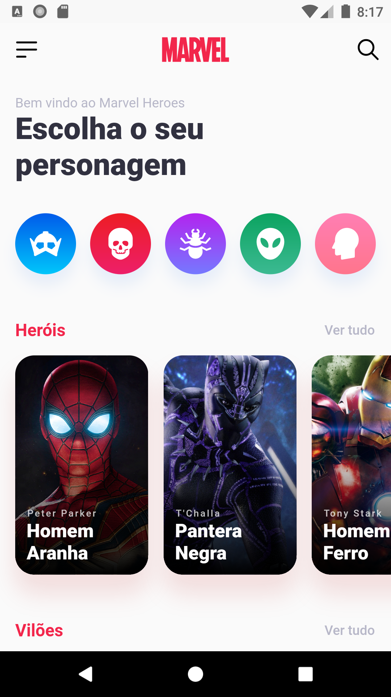
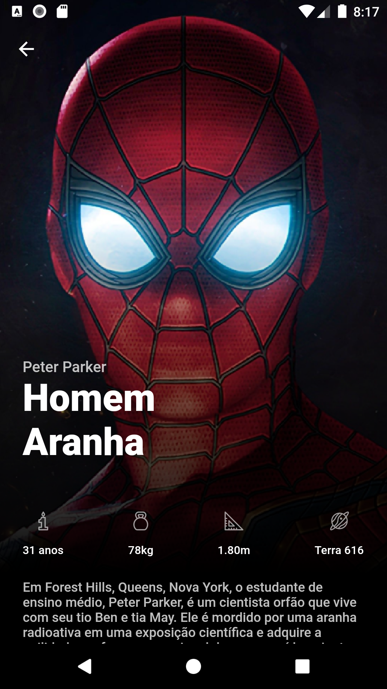
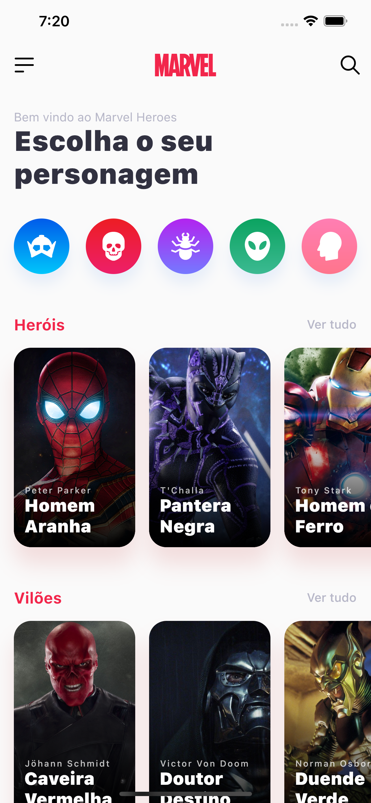
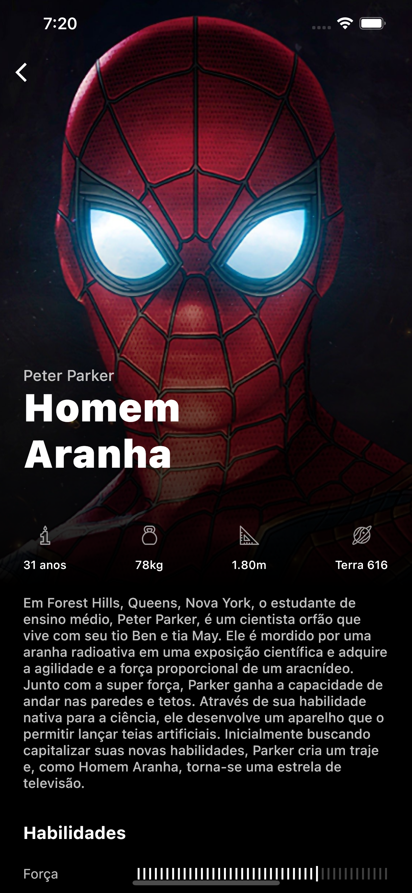

# Marvel Heroes

https://developer.marvel.com/

A challenge created by [umpontoseis](https://umpontoseis.com/) and published by [DevChallenge](https://devchallenge.com.br/).

## The challenge 

Create an application that lists Marvel characters, with their information, skills and movies. Following the design, prototype and other auxiliary files, available at: [marvel-heroes](https://github.com/Lorenalgm/marvel-heroes/)

## Practiced skills

1. Improving skills with the Framework Flutter
2. Use of SVG with Flutter 
3. Animations
4. Code organization

## Demo

## Screenshots

 

### Android

 

### IOS

 

